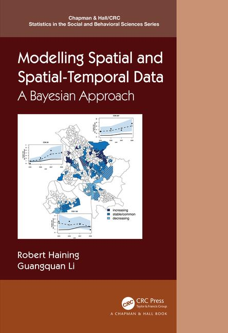

 

 By <a href="https://www.geog.cam.ac.uk/people/haining/" style="color:rgb(105 147 236)">Robert P. Haining</a> and <a href="https://www.northumbria.ac.uk/about-us/our-staff/l/guangquan-li/" style="color:rgb(105 147 236)">Guangquan Li</a>

----
<pre><code><a href="news.html">Our plan to deliver a 3.5 days training course on modelling spatial and spatial-temporal data. </a></code></pre>

----

<!-- https://easycloudsolutions.com/2011/02/16/how-to-display-an-image-in-html-with-padding/ for padding -->

### Welcome!

This is the accompanying website for our book **_Modelling Spatial and Spatial-Temporal Data: A Bayesian approach_**. Here we provide the datasets and the code so that the reader can perform the analyses featured in the book.

 

### Highlights of the book:

* The book is aimed at statisticians and quantitative social, economic and public health students and researchers who work with small area spatial and spatial-temporal data; 

* The book compares both hierarchical and spatial econometric modelling, providing both a reference and a teaching text with exercises in each chapter.

* The book provides a fully Bayesian, self-contained, treatment of the underlying statistical theory, with chapters dedicated to substantive applications.

 

### <a href="chapters.html" style="color:rgb(105 147 236)">Contents</a>:

* Part I covers fundamental issues arising when modelling small area spatial and spatial-temporal data.

* Part II focuses on modelling cross-sectional spatial data.

* Part III discusses modelling spatial-temporal data.

* Part IV suggests some future directions and challenges in modelling spatial and spatial-temporal data.

 

 

### Book review:

* "*The finely organized style of presentation makes it an excellent textbook and reference book for postgraduate students and quantitative researchers in different fields with little mathematical background. *" --- Anoop Chaturvedi, University of Allahabad (Journal of the Royal Statistical Society: Series A)

* "*This well-written book is a good source for the Bayesian concepts and methods to practice the spatial-temporal analysis using R and WinBugs codes. [...] I recommend this book to economics, health, statistics and computing professionals and researchers.*" --- Ramalingam Shanmugam, Texas State University (Journal of Statistical Computation and Simulation)

* "*....an excellent resource for graduate students, statisticians, and quantitative researchers who are interested in analyzing areal spatial data. The inclusion of both spatial hierarchical models and econometrics models is particularly unique. Finally, the book’s organization, contents, and writing style also encourage self-learning.*" --- Howard H. Chang, Department of Biostatistics and Bioinformatics, Emory University, Atlanta, Georgia, USA (Biometrics)
